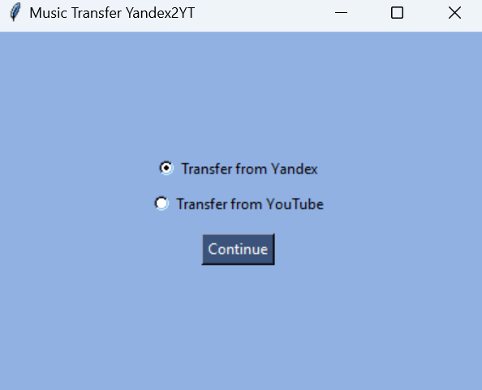

# Music Transfer: Yandex Music to YouTube Music

[English version](README_ENG.md)


## Описание
Приложение для переноса понравившейся музыки из **YandexMusic** в **YouTube Music**, а так же добавление понравившихся треков в отдельные плейлисты.


## Оглавление
1. [Установка](#установка)
2. [Настройка доступа](#настройка-доступа)
3. [Использование](#использование)
4. [Лицензия](#лицензия)
5. [P.s.](#ps)


## Установка
1. Убедитесь, что у вас установлен Python 3.8 или выше.
2. Клонируйте репозиторий:
   ```bash
   git clone https://github.com/AlisaSmusic_transfer_yandex2YT
   cd music_transfer_yandex2YT
3. Установите зависимости:

   ```bash
   pip install -r requirements.txt


## Настройка доступа
### 1. Получение токенов

#### **Yandex Music**:
[Самый простой способ получения Яндекс токена через браузер](https://github.com/MarshalX/yandex-music-api/discussions/513)

#### **YouTube Music**:
1. Перейдите в [Google Cloud Console](https://console.cloud.google.com/).
2. Создайте новый проект.
3. Включите **YouTube Data API v3**.
4. Создайте OAuth-ключи и получите `client_id` и `client_secret`.

### 2. **Настройка конфигурации**
1. Создайте файл `.env` в корневой папке
2. Скопируйте шаблон из `.env.example` и вставьте свои токены


## Использование
Выберете одну из опций: перенос музыки из Яндекс Музыки в Ютуб музыку или добавление понравившихся треков из Ютуб Музыки в отдельный существующий плейлист



Для переноса из яндекса введите название нового плейлиста, описание, название файла для сохранения названия трека и исполнителя в формате `.csv` (по умолчанию `songs.csv`) и количество песен для переноса


Для добавления понравившихся песен из ютуба в отдельный плейлист, вставьте ID существующего плейлиста, куда вы хотите добавить музыку, и напишите количество песен


Далее вы увидите страницу логов, которая проинформирует вас о завершении процесса.


## Лицензия
Этот проект распространяется под лицензией MIT. Подробнее см. в файле [LICENSE](LICENSE).


## P.s.
Проекст создавался для личного использования, так как в последнее время столкнулась с проблемой того, что многие исполнители, очевидно, не продлили контракт с Яндекс Музыкой, и новые альбомы там больше не выходят. Данное приложение позволяет составить микс плейлисты, позволяя слушать все любимые песни в одном месте :)

Если вы нашли баг или хотите предложить улучшение, создайте [issue](https://github.com/AlisaSk/music_transfer_yandex2YT/issues).

Буду рада вашим звездочкам :D