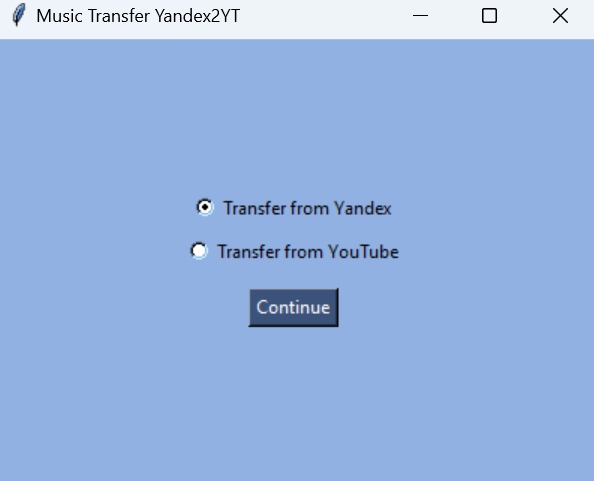
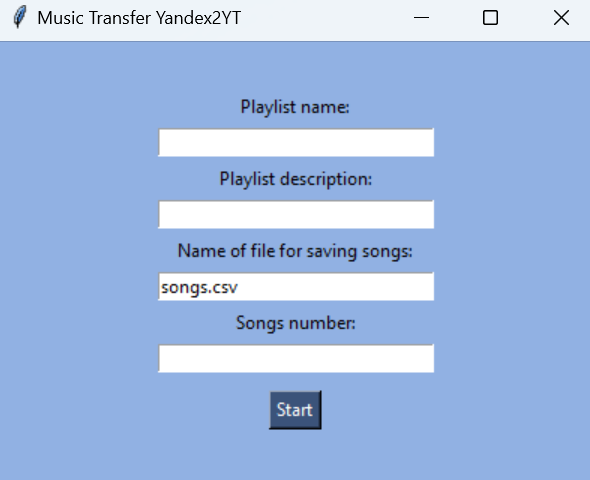
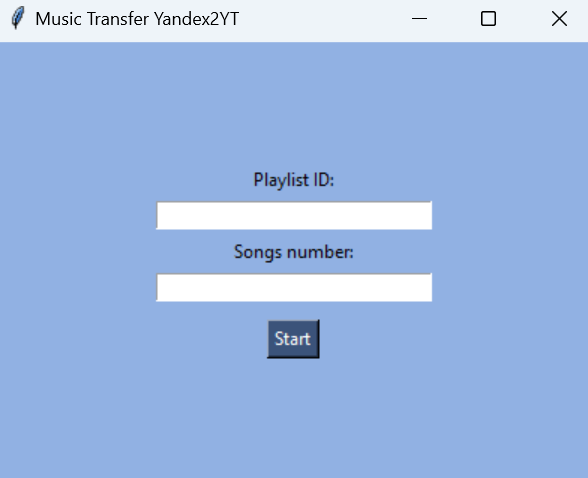

# Music Transfer: Yandex Music to YouTube Music

[Русская версия](README.md)

## Description
An application for transferring your favorite music from **Yandex Music** to **YouTube Music**, as well as adding liked tracks to separate playlists.

## Table of Contents
1. [Installation](#installation)
2. [Access Setup](#access-setup)
3. [Usage](#usage)
4. [License](#license)
5. [P.S.](#ps)

## Installation
1. Make sure you have Python 3.8 or higher installed.
2. Clone the repository:
   ```bash
   git clone https://github.com/AlisaSmusic_transfer_yandex2YT
   cd music_transfer_yandex2YT
   ```
3. Install dependencies:
   ```bash
   pip install -r requirements.txt
   ```

## Access Setup
### 1. Getting Tokens

#### **Yandex Music**:
[The easiest way to get a Yandex token via a browser](https://github.com/MarshalX/yandex-music-api/discussions/513)

#### **YouTube Music**:
1. Go to [Google Cloud Console](https://console.cloud.google.com/).
2. Create a new project.
3. Enable **YouTube Data API v3**.
4. Create OAuth credentials and get your `client_id` and `client_secret`.

### 2. **Configuration Setup**
1. Create a `.env` file in the root folder.
2. Copy the template from `.env.example` and paste your tokens.

## Usage
Choose one of the options: transfer music from Yandex Music to YouTube Music or add liked tracks from YouTube Music to a separate existing playlist.



To transfer from Yandex, enter the name of the new playlist, description, the filename for saving track titles and artists in `.csv` format (default is `songs.csv`), and the number of songs to transfer.



To add liked songs from YouTube to a separate playlist, paste the ID of the existing playlist where you want to add music and enter the number of songs.



Next, you'll see a log page that will inform you when the process is complete.

## License
This project is licensed under the MIT License. For more details, see the [LICENSE](LICENSE) file.

## P.S.
This project was created for personal use because I recently encountered an issue where many artists apparently did not renew their contracts with Yandex Music, and new albums are no longer released there. This application helps create mix playlists, allowing you to listen to all your favorite songs in one place. :)

If you find a bug or want to suggest an improvement, feel free to create an [issue](https://github.com/AlisaSk/music_transfer_yandex2YT/issues).

I’d appreciate your stars! :D

